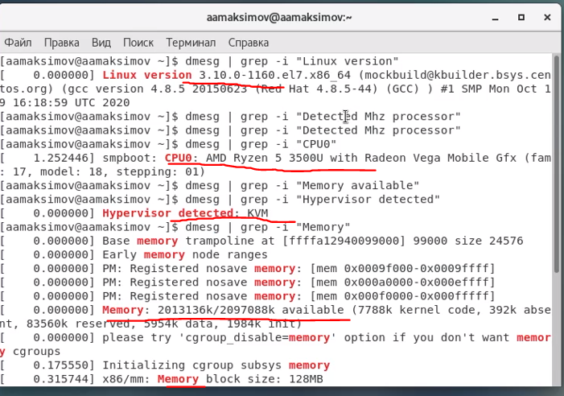

# Отчет по лабораторной работе № 1

## По дисциплине Математическое Моделирование

### Выполнил: Максимов Алексей Александрович
### Группа: НПИ-бд-02-20

  #### Российский Университет Дружбы Народов
  #### г. Москва

# Цель работы

Обучиться работе с гит.

# Задание

Выполнить задания на изучение базовых команд гит и их выполнения через терминал.

# Выполнение лабораторной работы
### Выполняем базовые настроки и создаем проэкт (репизиторий и html-файл)

1. Установка имени и электронной почты
2. Параметры установки окончаний строк
3. Установка отображения unicode
4. Создайте страницу «Hello, World»
5. Создание репозитория
6. Добавление файла в репозиторий
7. Проверка состояние репозитория

### Смотрим на реакцию гит на внесенные в проэкт изменения

1. Измените страницу «Hello, World» и проверьте статус

###

1.

###

1.

###

1.

###

1.

###

1.

###

1.

###

1.

###

1.

###

1.

###

1.

###

1.

###

1.

###

1.

###

1.

###

1.

###

1.

###

1.

###

1.

Описываются проведённые действия, в качестве иллюстрации даётся ссылка на иллюстрацию (рис. @fig:001).

# Выводы

Здесь кратко описываются итоги проделанной работы.

# Список литературы{.unnumbered}

::: {#refs}
:::
