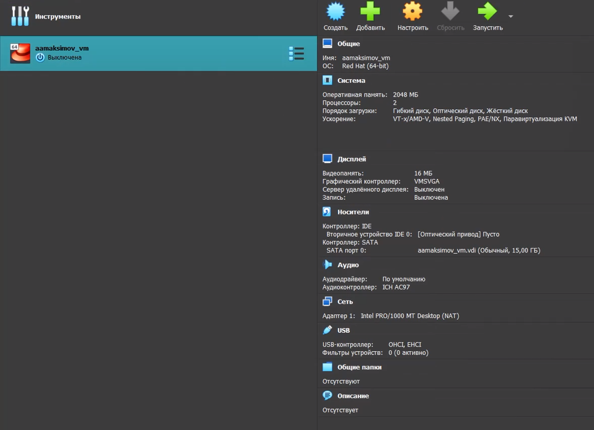
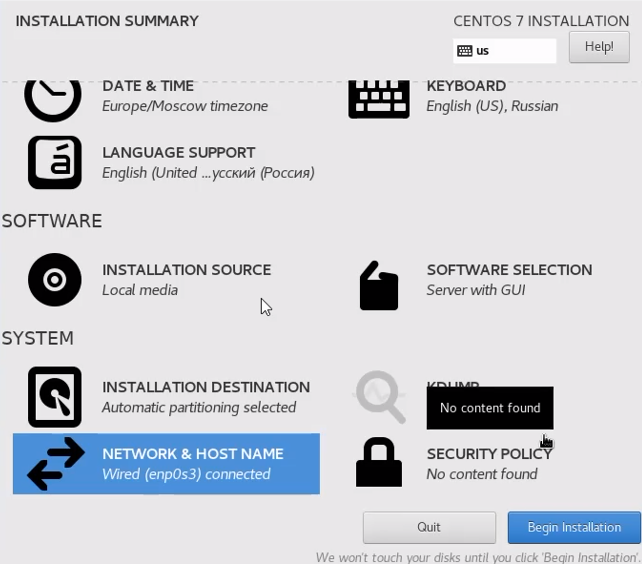
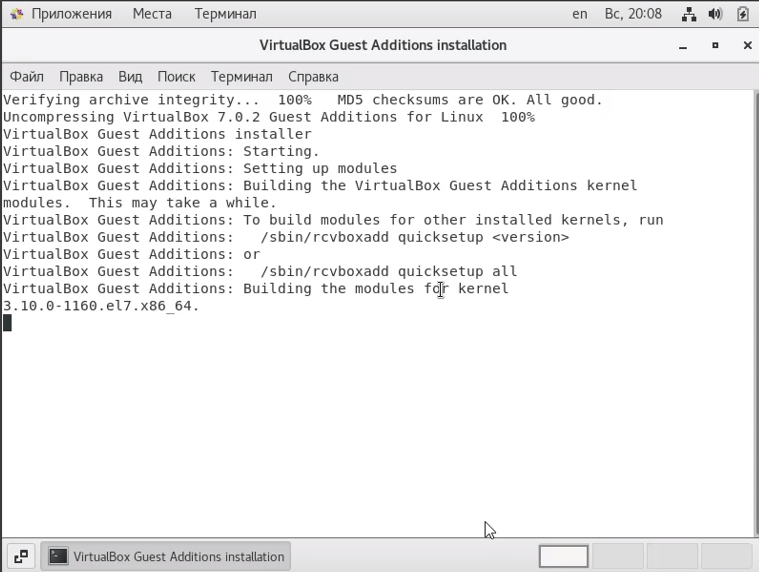

# Отчет по лабораторной работе № 1

## По дисциплине Информационная безопасность

### Выполнил: Максимов Алексей Александрович
### Группа: НПИ-бд-01-20

  #### Российский Университет Дружбы Народов
  #### г. Москва

# Цель работы

Целью данной работы является приобретение практических навыков установки операционной системы на виртуальную машину, настройки минимально необходимых для дальнейшей работы сервисов.

# Задание

Выполнить задания на изучение базовых команд гит и их выполнения через терминал.

# Выполнение лабораторной работы
### Выполняем базовые настроки и создаем виртальную машину(репизиторий)

1. Установка имени
2. Памяти (20 гБ) динамический виртуальный диск
3. Образа машины
4. Оперативной памяти (2 гБ)
5. Создание репозитория

### Применяем начальные настройки машины
1. дату и время
2. Язык
3. Раскладку клавиатуры
4. Подключение к сети
5. Отключаем RDUMP

6. Пароль
7. Пользователя

### Устанавливаем драйвера для гостевой ОС

### Пробуем найти требемую информацию с помощью команды dmesg | grep -i "..."

# Выводы

Создали виртуальную машину.
