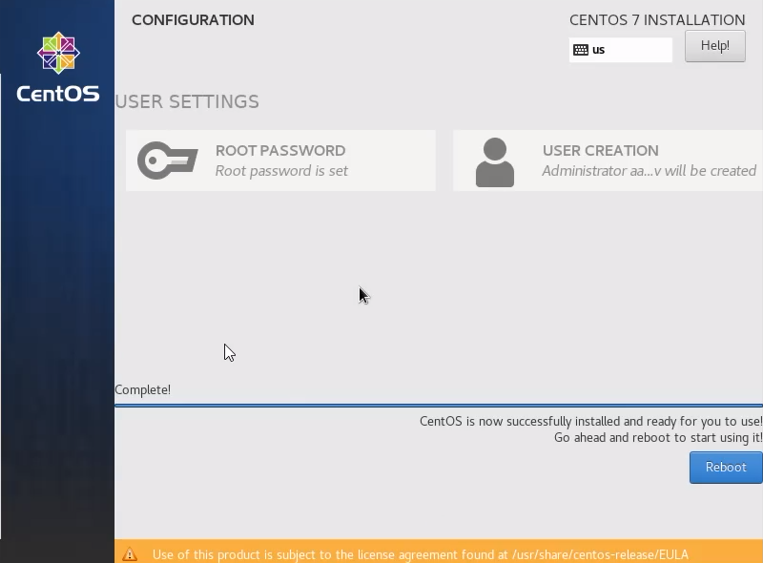

# Отчет по лабораторной работе № 1

## По дисциплине Математическое Моделирование

### Выполнил: Максимов Алексей Александрович
### Группа: НПИ-бд-02-20

  #### Российский Университет Дружбы Народов
  #### г. Москва

# Цель работы

Обучиться работе с гит.

# Задание

Выполнить задания на изучение базовых команд гит и их выполнения через терминал.

# Выполнение лабораторной работы
### Выполняем базовые настроки и создаем проэкт (репизиторий и html-файл)

1. Установка имени и электронной почты
2. Параметры установки окончаний строк
3. Установка отображения unicode
4. Создайте страницу «Hello, World»
5. Создание репозитория
6. Добавление файла в репозиторий
7. Проверка состояние репозитория

### Смотрим на реакцию гит на внесенные в проэкт изменения

1. Измените страницу «Hello, World» и проверьте статус
2. Коммит изменений
3. Добавьте стандартные теги страницы и добавьте изменения в гит
4. Комментим их

### Работаем с историей изменений

1. История
2. Получение старых версий
3. Создание тегов версий
4. Переключение по имени тега
5. Просмотр тегов с помощью команды tag

### Отмена локальных изменений (до индексации)

1. Переключитесь на ветку master
2. Измените hello.html и  проверьте состояние
3. Отмена изменений в рабочем каталоге

### Отмена проиндексированных изменений (перед коммитом)

1. Измените файл и проиндексируйте изменения
2. Проверьте состояние
3. Выполните сброс буферной зоны
4. Переключитесь на версию коммита

### Отмена коммитов

1. Измените файл и сделайте коммит
2. Сделайте коммит с новыми изменениями, отменяющими предыдущие
3. Проверьте лог

(к сожалению скриншоты с командами в терминале были утеряны, в случае недоверия, вы можете посмтореть запись выполнеия лабораторной работы)

### Удаление коммиттов из ветки

1. Команда git reset
2. Проверьте нашу историю
3. Отметьте эту ветку с ошибкой
4. Сброс коммитов к предшествующим коммиту Oops
5. посмотрите все коммиты

### Удаление тега oops

1. Удаление тега oops

### Внесение изменений в коммиты

1. Измените страницу, а затем сделайте коммит
2. добавляем изенения (email)
3. Измените предыдущий коммит
4. Просмотр истории

### Перемещение файлов

1. Переместите файл hello.html в каталог lib
2. Второй способ перемещения файлов
3. Коммит в новый каталог

### Добавляем файл с куском основной страницы

1. Добавление index.html 

###  Git внутри: Каталог .git

1. Каталог .git
2. База данных объектов
3. Углубляемся в базу данных объектов
4.  Файл HEAD

###  Работа непосредственно с объектами git

1. Поиск последнего коммита
2. Вывод последнего коммита с помощью SHA1 хэша
3. Поиск дерева
4. Вывод каталога lib
5. Вывод файла hello.html

### Создание ветки

1. Создайте ветку
2. Добавьте файл стилей style.css
3. Измените основную страницу
4. Измените index.html

### Навигация по веткам

1. Переключение на ветку master
2. Вернемся к ветке style
3. Изменения в ветке master
4. Создайте файл README в ветке master
5. Просмотрите текущие ветки

### Слияние

1. Слияние веток

###  Создание конфликта

1. Вернитесь в master и создайте конфликт
2. Просмотр веток

###  Разрешение конфликтов

1. Слияние master с веткой style
2. Решение конфликта
3. Сделайте коммит решения конфликта

###  Сброс ветки style

1.  Сброс ветки style
2. Проверьте ветку

###  Сброс ветки master

1. Сброс ветки master

###  Перебазирование

1. Перебазирование

вполняем
git checkout style
git rebase master
git log --graph

(к сожалению скриншоты с командами в терминале были утеряны, в случае недоверия, вы можете посмтореть запись выполнеия лабораторной работы)

###  Клонирование репозиториев

1. Перейдите в рабочий каталог
2. Создайте клон репозитория hello
3. Просмотр клонированного репозитория
4. Просмотрите историю репозитория

### Работа с origin и Изменение оригинального репозитория

1. Просмотр информации об Origin
2. Удаленные ветки
3. Список удаленных веток
4. Внесите изменения в оригинальный репозиторий hello
5. Извлечение изменений

###  Слияние извлеченных изменений, Добавление ветки наблюдения и Добавление удаленного репозитория

1. Проверьте README.md (см. следующий скриншот)
2. Слейте извлеченные изменения в локальную ветку master
3. Еще раз проверьте файл README.md
4. Добавьте локальную ветку, которая отслеживает удаленную ветку
5. Добавление удаленного репозитория

### Отправка изменений

1. Измените файл README.md

### Извлечение общих изменений

1.Быстро переключитесь в
клонированный репозиторий и извлеките изменения, только что отправленные в
общий репозиторий.

# Выводы

Научились работе с гит посредством терминала.

::: {#refs}
:::
