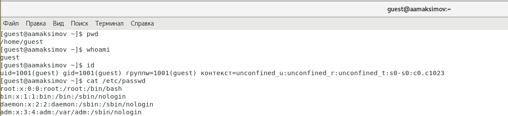

---
## Front matter
lang: ru-RU
title: Презентация по защите лабораторной работы №2
subtitle: По предмету Математическое моделирование
author:
  - Максимов А. А.
institute:
  - Российский университет дружбы народов, Москва, Россия
date: 18 февраля 2023

## i18n babel
babel-lang: russian
babel-otherlangs: english

## Formatting pdf
toc: false
toc-title: Содержание
slide_level: 2
aspectratio: 169
section-titles: true
theme: metropolis
header-includes:
 - \metroset{progressbar=frametitle,sectionpage=progressbar,numbering=fraction}
 - '\makeatletter'
 - '\beamer@ignorenonframefalse'
 - '\makeatother'
---

# Информация

## Докладчик

:::::::::::::: {.columns align=center}
::: {.column width="70%"}

  * Максимов Алексей Александрович
  * профессор кафедры прикладной информатики и теории вероятностей
  * Российский университет дружбы народов
  * <https://github.com/Leximus555/study_2022-2023_mathmod/edit/master/labs>

:::
::::::::::::::

## Задача

1. Провести аналогичные рассуждения и вывод дифференциальных уравнений,
если скорость катера больше скорости лодки в n раз (значение n задайте
самостоятельно)
2. Построить траекторию движения катера и лодки для двух случаев. (Задайте
самостоятельно начальные значения)
Определить по графику точку пересечения катера и лодки.

## Ход работы

получили задачу (№32)

произвели вычисления, и создали программу, которая выводит аналогичные вычисления для двух случаев движения лодки ( по часовой и против часовой)

полчучили изображения соответствующие заданным в начале условиям

## Вывод 

Поработали с Julia и решили задачу.

