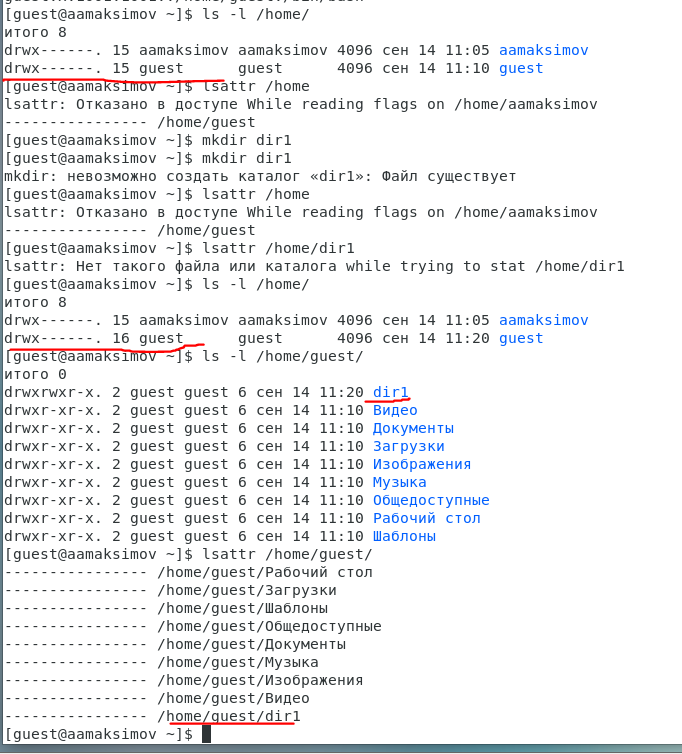

# Отчет по лабораторной работе № 2

## По дисциплине Информационная безопасность

### Выполнил: Максимов Алексей Александрович
### Группа: НПИ-бд-01-20

  #### Российский Университет Дружбы Народов
  #### г. Москва

# Цель работы

Получение практических навыков работы в консоли с атрибутами файлов, закрепление теоретических основ дискреционного разграничения доступа в современных системах с открытым кодом на базе ОС Linux.

# Задание

Выполнить задания по работе с доступом файлов и дирректорий.

# Выполнение лабораторной работы
### создаем пользователя guest

### Входим по имя пользователя guest

### Уточняем имя пользователя, его группу, а также группы, куда входит пользователь, командой id. Выведенные значения uid, gid и др. запоминаем

### Сравниваем значения uid, gid и др. Создаем директорию и проверяем ее права

### Забираем права на дирректорию и пытаемся вывполнить операции

### Заполняем таблицы из задания.

# Выводы

Получили практические навыкыки работы в консоли с атрибутами файлов, закрепление теоретических основ дискреционного разграничения доступа в современных системах с открытым кодом на базе ОС Linux.
