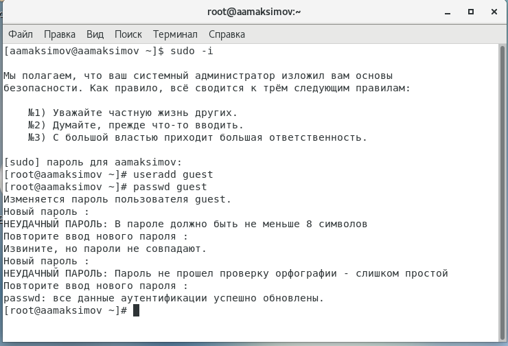

# Отчет по лабораторной работе № 2

## По дисциплине Математическое Моделирование

### Выполнил: Максимов Алексей Александрович
### Группа: НПИ-бд-02-20

  #### Российский Университет Дружбы Народов
  #### г. Москва

# Цель работы

ффф.

# Задание

ффф.

# Теоретическое введение

Здесь описываются теоретические аспекты, связанные с выполнением работы.

# Выполнение лабораторной работы

###

1.
2.
3.

###

1.
2.
3.

# Выводы

Здесь кратко описываются итоги проделанной работы.

# Список литературы{.unnumbered}

