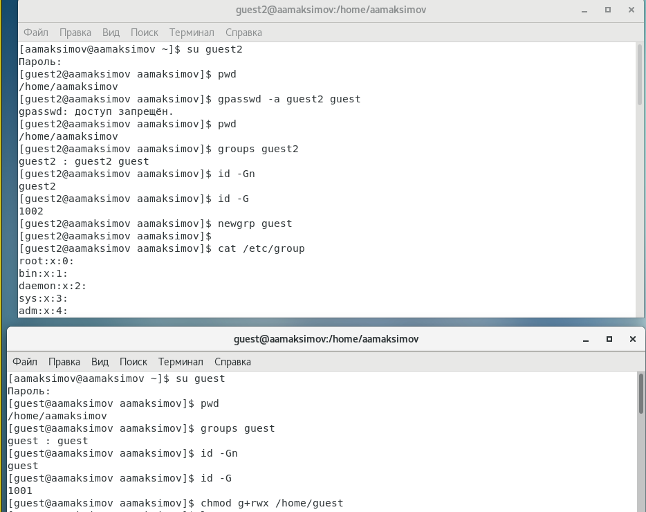
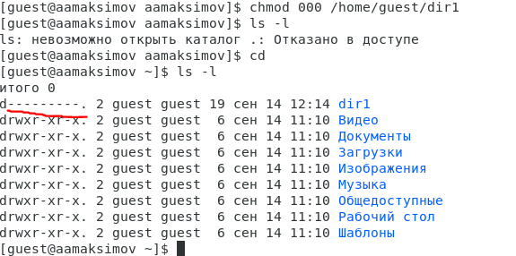
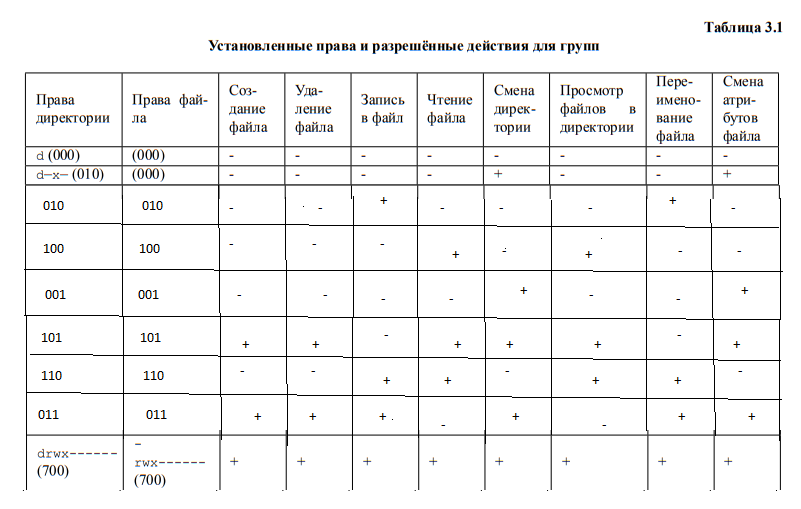

# Отчет по лабораторной работе № 3

## По дисциплине Информационная безопасность

### Выполнил: Максимов Алексей Александрович
### Группа: НПИ-бд-01-20

  #### Российский Университет Дружбы Народов
  #### г. Москва

# Цель работы

Получение практических навыков работы в консоли с атрибутами файлов для групп пользователей.

# Задание

Выполнить задания по дискреционному разграничению прав в Linux.

# Выполнение лабораторной работы
### Создаем пользователя guest2 и добавляем его в группу guest

### Осуществляем вход в систему от двух пользователей на двух разных консолях: guest на первой консоли и guest2 на второй консоли.

Уточняем имя наших пользователей, их группу, кто входит в неёи к каким группам принадлежат они сами.

### От имени пользователя guest снимаем с директории /home/guest/dir1 все атрибуты и проверяем коррекстность снятия атрибутов

### Заполняем таблицы

# Выводы

Получили практические навыки работы в консоли с атрибутами файлов для групп пользователей.
