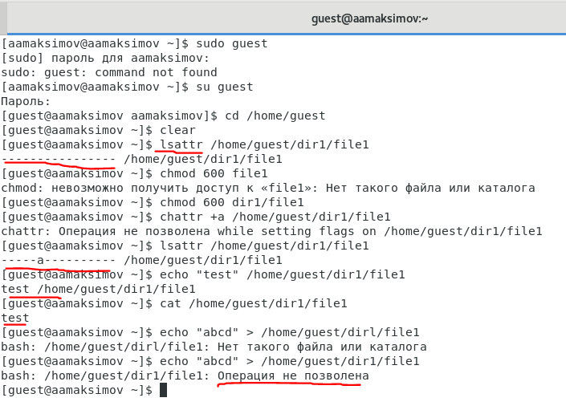
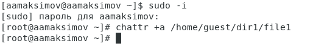
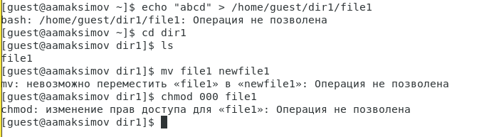
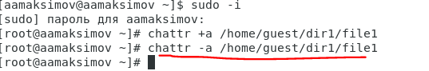
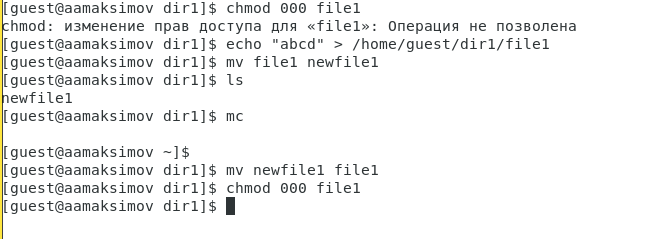
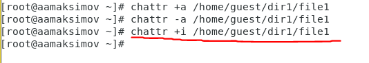
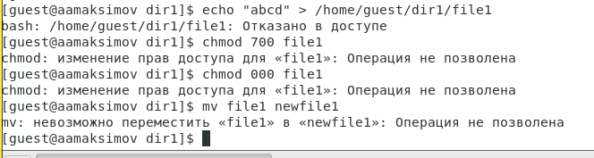
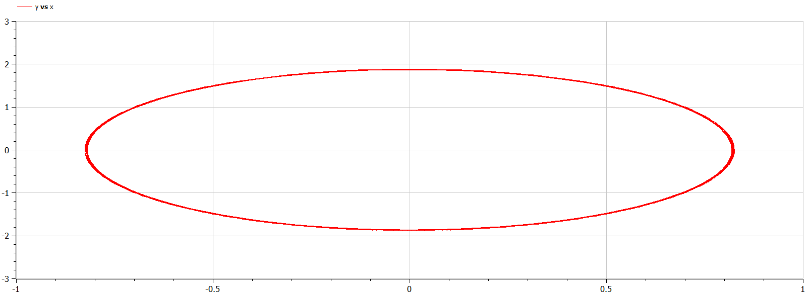
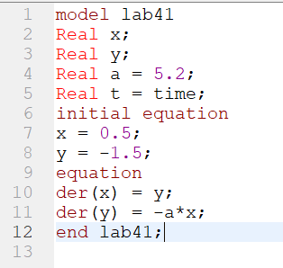

---
## Front matter
title: "Отчет по лабораторной работе № 4"
subtitle: "По дисциплине Математическое Моделирование"
author: "Максимов Алексей Александрович"

## Generic otions
lang: ru-RU
toc-title: "Содержание"

## Bibliography
bibliography: bib/cite.bib
csl: pandoc/csl/gost-r-7-0-5-2008-numeric.csl

## Pdf output format
toc: true # Table of contents
toc-depth: 2
lof: true # List of figures
lot: true # List of tables
fontsize: 12pt
linestretch: 1.5
papersize: a4
documentclass: scrreprt
## I18n polyglossia
polyglossia-lang:
  name: russian
  options:
	- spelling=modern
	- babelshorthands=true
polyglossia-otherlangs:
  name: english
## I18n babel
babel-lang: russian
babel-otherlangs: english
## Fonts
mainfont: PT Serif
romanfont: PT Serif
sansfont: PT Sans
monofont: PT Mono
mainfontoptions: Ligatures=TeX
romanfontoptions: Ligatures=TeX
sansfontoptions: Ligatures=TeX,Scale=MatchLowercase
monofontoptions: Scale=MatchLowercase,Scale=0.9
## Biblatex
biblatex: true
biblio-style: "gost-numeric"
biblatexoptions:
  - parentracker=true
  - backend=biber
  - hyperref=auto
  - language=auto
  - autolang=other*
  - citestyle=gost-numeric
## Pandoc-crossref LaTeX customization
figureTitle: "Рис."
tableTitle: "Таблица"
listingTitle: "Листинг"
lofTitle: "Список иллюстраций"
lotTitle: "Список таблиц"
lolTitle: "Листинги"
## Misc options
indent: true
header-includes:
  - \usepackage{indentfirst}
  - \usepackage{float} # keep figures where there are in the text
  - \floatplacement{figure}{H} # keep figures where there are in the text
---

# Цель работы

Ознакомиться с языком программирования Julia и OpenModelica. 

# Задание

# Теоретическое введение

Движение грузика на пружинке, маятника, заряда в электрическом контуре, а также эволюция во времени многих систем в физике, химии, биологии и других науках при определенных предположениях можно описать одним и тем же дифференциальным уравнением, которое в теории колебаний выступает в качестве основной модели. Эта модель называется линейным гармоническим осциллятором. Мы рассмотрим три случая: 
1. Колебания гармонического осциллятора без затуханий и без действий внешней
силы
2. Колебания гармонического осциллятора c затуханием и без действий внешней
силы
3. Колебания гармонического осциллятора c затуханием и под действием внешней
силы

# Выполнение лабораторной работы

### Произвели рассчеты аналогичные приведенному заданию
В результате вычислили, что в первом случае войска У достигнут нуля за примерно 1,6 ед. времени, а во втором случае за прмерно 2,2 ед. времени
Написали программы, которые показывают на графиках колебания и фазовые портреты во всех трех случаях

### на Julia

### на OpenModelica

# Выводы

Решили задачу и написали прогррамму на Julia и OpenModelica

