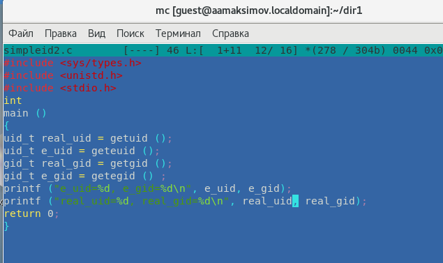

---
## Front matter
lang: ru-RU
title: Презентация по защите лабораторной работы №5
subtitle: По предмету Математическое моделирование
author:
  - Максимов А. А.
institute:
  - Российский университет дружбы народов, Москва, Россия
date: 7 03 2023

## i18n babel
babel-lang: russian
babel-otherlangs: english

## Formatting pdf
toc: false
toc-title: Содержание
slide_level: 2
aspectratio: 169
section-titles: true
theme: metropolis
header-includes:
 - \metroset{progressbar=frametitle,sectionpage=progressbar,numbering=fraction}
 - '\makeatletter'
 - '\beamer@ignorenonframefalse'
 - '\makeatother'
---

# Информация

## Докладчик

:::::::::::::: {.columns align=center}
::: {.column width="70%"}

  * Максимов Алексей Александрович
  * Российский университет дружбы народов
  * <https://github.com/Leximus555/study_2022-2023_mathmod/edit/master/labs>

:::
::::::::::::::

## Задача

## Ход работы

получили задачу (№32)

создали программу на julia, моделидующую численности хищьников и жертв при заданных условиях

получили графики

создали программу на OpenModelica, моделидующую численности хищьников и жертв при заданных условиях

получили графики

## Вывод 

Поработали с Julia и OpenModelica и решили задачу.

