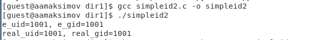

# Презентация по лабораторной работе № 5

## По дисциплине Информационная безопасность

### Выполнил: Максимов Алексей Александрович
### Группа: НПИ-бд-01-20

  #### Российский Университет Дружбы Народов
  #### г. Москва

# Цель работы

Изучение механизмов изменения идентификаторов, применения SetUID- и Sticky-битов. Получение практических навыков работы в консоли с дополнительными атрибутами. Рассмотрение работы механизма смены идентификатора процессов пользователей, а также влияние бита Sticky на запись и удаление файлов.

# Ход работы

# Выполнение лабораторной работы
### Создаем программу simpleid, компилируем и проверяем верность выведенных данных

### Создаем программу simpleid2, компилируем и проверяем верность выведенных данных, меняем владельца файла

###  Создаем программу simpleid2, компилируем, меняем владельца файла
возниклас проблема с пониманием синтаксиса активации программы

### Исследование Sticky-бита
#### проверяем наличие t атрибута на папке tmp, создаем файл в папке от пользователя 1 и пытаемся работать с ним от пользователя 2

#### Затем убираем атрибут t и повторяем действия

# Выводы

Изучили механизмы изменения идентификаторов. Получили практические навыки работы в консоли с дополнительными атрибутами. Рассмотрели работы механизма смены идентификатора процессов пользователей, а также влияние бита Sticky на запись и удаление файлов.
