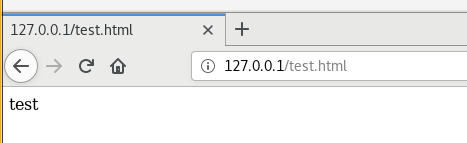

# Презентация по лабораторной работе № 6

## По дисциплине Информационная безопасность

### Выполнил: Максимов Алексей Александрович
### Группа: НПИ-бд-01-20

  #### Российский Университет Дружбы Народов
  #### г. Москва

# Цель работы

Развить навыки администрирования ОС Linux. Получить первое практическое знакомство с технологией SELinux1. Проверить работу SELinx на практике совместно с веб-сервером Apache

# Ход работы

# Выполнение лабораторной работы
### Подготовка лабораторного стенда и методические рекомендации

### Войдите в систему с полученными учётными данными и убедитесь, что SELinux работает в режиме enforcing политики targeted

### Найдите веб-сервер Apache в списке процессов, определите его контекст безопасности и занесите эту информацию в отчёт.

### Определите тип файлов и поддиректорий, находящихся в директории /var/www. Создайте от имени суперпользователя html-файл /var/www/html/test.html

### Измените контекст файла /var/www/html/test.html с httpd_sys_content_t на любой другой и проверьте лог-файлы веб-сервера

### Попробуйте запустить веб-сервер Apache на прослушивание ТСР-порта 81

### Верните контекст httpd_sys_cоntent__t к файлу /var/www/html/ test.html и исправьте обратно конфигурационный файл apache, вернув Listen 80. Удалите файл /var/www/html/test.html:

# Выводы

Развили навыки администрирования ОС Linux. Получили первое практическое знакомство с технологией SELinux1. Проверили работу SELinx на практике совместно с веб-сервером Apache