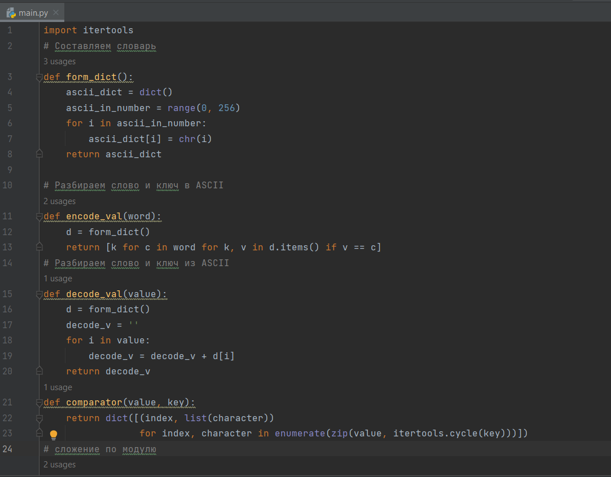
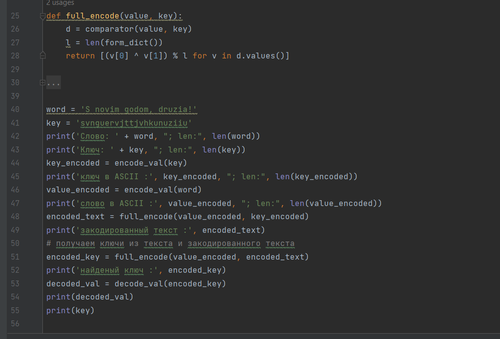
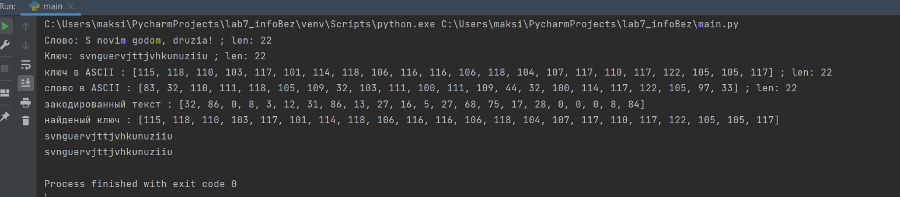

# Презентация по лабораторной работе № 7

## По дисциплине Информационная безопасность

### Выполнил: Максимов Алексей Александрович
### Группа: НПИ-бд-01-20

  #### Российский Университет Дружбы Народов
  #### г. Москва

# Цель работы

Освоить на практике применение режима однократного гаммирования.

# Задание

Создать программу для шифровки и поиска ключа.

# Выполнение лабораторной работы
### написал программу

### смотрим результат

# Выводы

Освоили на практике применение режима однократного гаммирования.